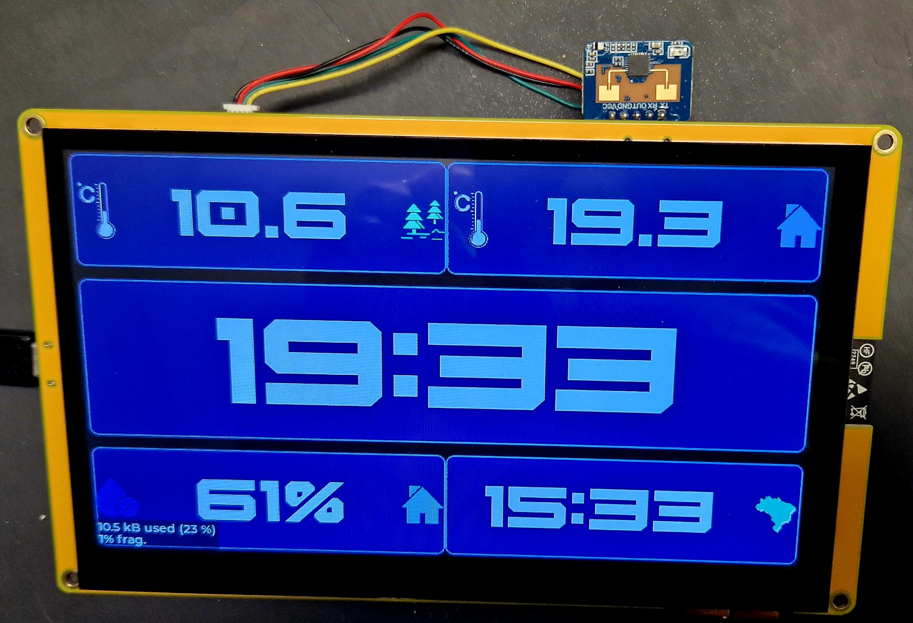
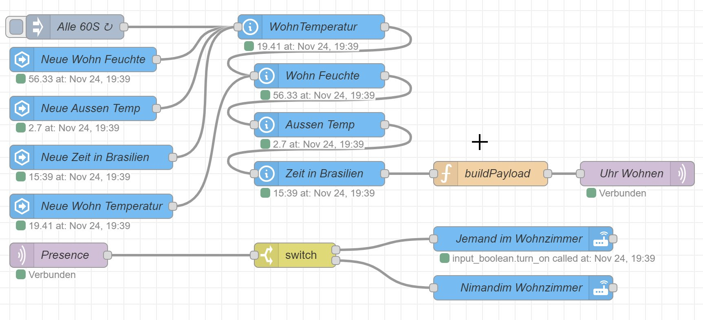
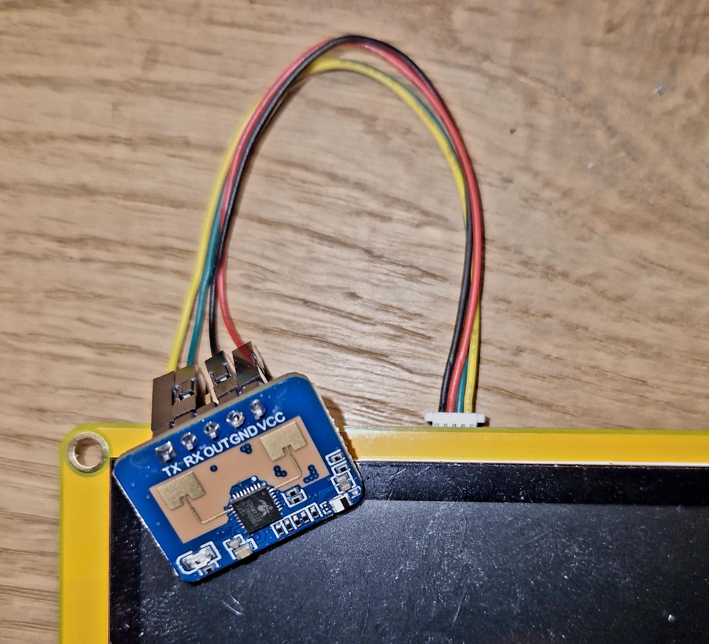
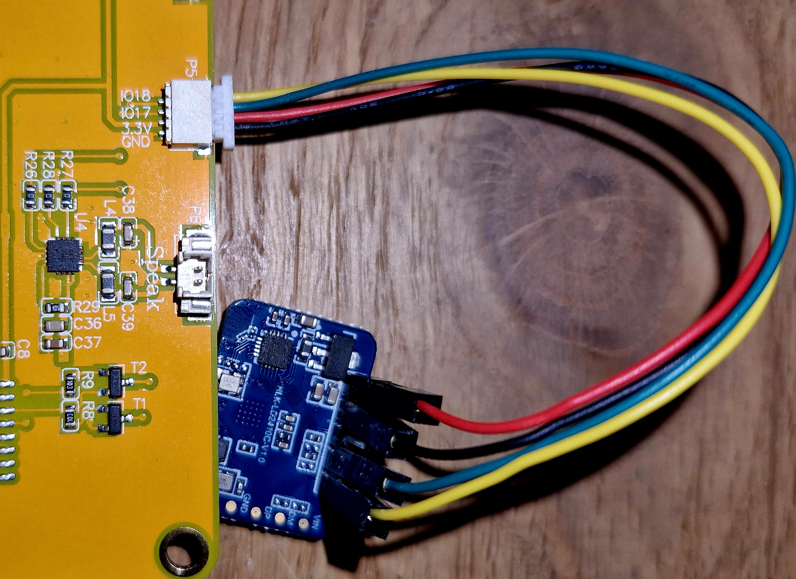

# ESP32Clock7inch
Living Room Clock 7inch with ES32 and Homeassistent connect

I designt the UI with SquareLine Studio. You find the Project in Folder UI. I create a Node-Red flow to read Homeassistant sensors an send them as Json via MQTT via topic 'uhrwohnen/data'. 

### Presence Detectedion
I implemeted a screensaver witch dims the backlight of the Display down, after 14000ms when no presence detected from a LD2410C radar sensor. The data from LD2410C will send with MQTT topic 'uhrwohnen/presence'.

You can use P4 or P5 connector witch is pin 17(TXD) and 18(RXD)

## Hardware:
* [Elecrow ESP32 7.0-inch](https://de.aliexpress.com/item/1005005928865239.html)
* [HLK-LD2410C](https://de.aliexpress.com/item/1005005069619177.html)

## Links
* [Elecrow Wiki ESP32 Display 7.0''](https://www.elecrow.com/wiki/index.php?title=ESP32_Display_7.0%27%27_Intelligent_Touch_Screen_Wi-Fi%26BLE_800*480_HMI_Display)
* [Arduino_GFX Dev Device Declaration](https://github.com/moononournation/Arduino_GFX/wiki/Dev-Device-Declaration#esp32-8048s070)
* [7.0inch_ESP32-8048S070 on GitHub](https://github.com/wegi1/ESP32-8048S070-7INCH-LCD)
* [SquareLine Studio Documentation](https://docs.squareline.io/docs/squareline)